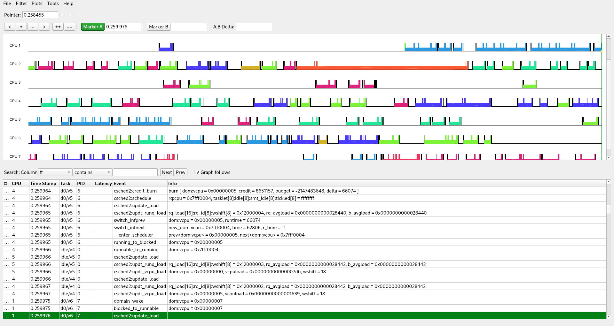

# XenTrace plugin for KernelShark [](https://github.com/giuseppe998e/kernelshark-xentrace-plugin/tags)
<p>
    
    This plugin allows you to view the traces generated by XenTrace on KernelShark-v2.<br>
    This is a project for the final three-year degree exam at the University of Turin.<br>
    Development is supervised by Dario Faggioli (<a href="https://github.com/dfaggioli">@dfaggioli</a>) and Enrico Bini (<a href="https://github.com/ebni">@ebni</a>).
</p>
<br>
<br>
<br>

## Building
### Dependencies
* `xen` (opt.)
* [`json-c`](https://github.com/json-c/json-c)

### Testing/Development
```shell
$ git clone --recurse-submodules https://github.com/giuseppe998e/kernelshark-xentrace-plugin.git
$ cd kernelshark-xentrace-plugin/
$ make CFLAGS="-fPIC -Wall -g -DDEBUG"
```
**N.B.** KernelShark should be compiled with the argument `-DCMAKE_BUILD_TYPE=Debug` for a better debugging experience.

### Optimized for usage
```shell
$ git clone --recurse-submodules https://github.com/giuseppe998e/kernelshark-xentrace-plugin.git
$ cd kernelshark-xentrace-plugin/
$ make
```

## Usage
```shell
$ export XEN_CPUHZ=3,6G # Sets the CPU speed used (in (G)hz / (M)hz / (K)hz / hz )
$ export XEN_ABSTS=1    # Sets the timestamp as absolute value ( 1 / Y / y ) (WIP)
$ kernelshark -p out/ks-xentrace.so trace.xen
```
**N.B.** When environment variables are not set, the plugin uses predefined values: `2,4G` and `0` respectively.

## License
This plugin is released under the `GNU Lesser General Public License v3 (or later)`.  
This plugin uses code from various projects:
* `libkshark.h` and `libkshark-plugin.h`, from [KernelShark-v2.beta](https://git.kernel.org/pub/scm/utils/trace-cmd/kernel-shark.git), released under the `LGPLv2.1`;
* `trace.h`, from [Xen](https://xenbits.xen.org/gitweb/?p=xen.git;a=summary), released under the `MIT License`;
* [XenTrace-Parser](https://github.com/giuseppe998e/xentrace-parser) released under the `LGPLv3`.
